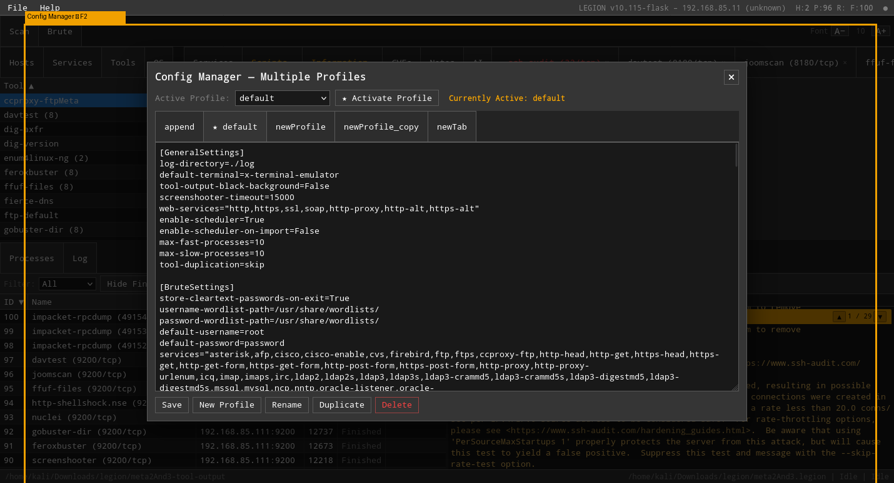
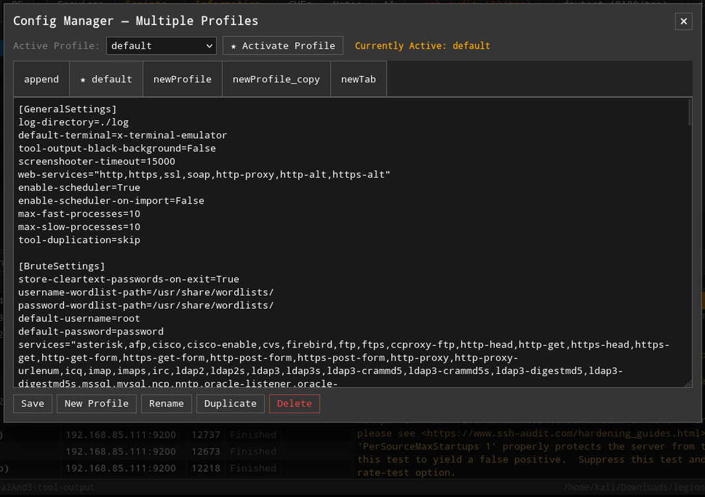

# LegionnAIre

> A network penetration testing framework with a modern Flask web UI and integrated AI-powered host analysis.


---

## Why I built this

I've always liked Legion. The layout — hosts on the left, tabbed detail panels on the right, a live process list at the bottom — is genuinely good UX for a pentest workflow. But the PyQt6 desktop app had friction: it required a full Qt environment, X11 forwarding when working remotely, and a brittle dependency stack that broke on every Kali update.

So I rewrote the interface as a Flask web app. The layout is identical to the original. The keyboard shortcuts, tab structure, and process model are the same. The underlying Python scanning engine (`controller.py`, `logic.py`, the SQLAlchemy ORM, the staged nmap pipeline) is unchanged — I just replaced every Qt widget with its HTML equivalent, polled with a 1.5-second snapshot API instead of Qt signals, and ran the whole thing in a browser.

While I was in there I added the things I'd always wanted: AI host analysis via Claude (Vertex AI), keyword match highlighting with navigation arrows, parallel staged nmap, a config GUI so you don't have to hand-edit `legion.conf`, and about 45 other features. The name **LegionnAIre** reflects the AI addition.

---

## Features

### Core scanning
- **Parallel staged nmap** — stages 1–5 (port ranges) run simultaneously; stage 6 (NSE/vulners) runs after all stages finish against every discovered open port
- **45 tools auto-scheduled** on service discovery — feroxbuster, gobuster, nuclei, netexec, enum4linux-ng, ssh-audit, testssl, and more
- **Live output streaming** — output appears in real time as tools run; progress % for nmap via `--stats-every 5s`
- **Keyword match highlighting** — set search terms in Settings; matching lines turn orange in tool output; ▲/▼ arrows navigate between hits


### Web interface
- Runs in any browser at `http://127.0.0.1:PORT` — works locally or over SSH port forwarding with no X11 needed
- Layout identical to the original Legion desktop app: host list left, tabbed panels right, process list bottom
- **All splitters draggable** with saved position; **font size controls** for upper and lower panels independently
- **Sticky process table header**, scrollable tab bar, context menus that stay in viewport
- Opens Firefox automatically on start with a dedicated isolated profile


### AI host analysis (Claude via Vertex AI)
- **Phase 1 — Synthesizer**: reads all tool output, NSE scripts, CVEs, and analyst notes for a host; extracts a structured findings table (severity-coded Critical/High/Medium/Low/Info)
- **Phase 2 — Attack Planner**: on-demand; takes Phase 1 findings as input and produces a specific, actionable attack plan with exact commands
- **Persistent history DB** at `~/.local/share/legion/ai_history.db` — analyses survive project switches; Jaccard similarity matching shows historical hosts that look like the current target (≥95% match on port/service/version fingerprint)
- Auth via Google ADC (`gcloud auth application-default login`) — no API key stored anywhere


### Notes and terminal integration
- **Ctrl+B** — copies the current terminal selection (or DOM output selection) into the host's Notes tab with ANSI colour preserved
- Notes render with full ANSI-to-HTML conversion; Log tab also renders colour codes
- All nmap stage commands are written to Notes automatically so scans are reproducible


### Config manager (F2)
- **Easy Edit mode** — structured GUI for all `legion.conf` sections: labeled forms for GeneralSettings/BruteSettings/ToolSettings, per-stage StagedNmapSettings, searchable tables for HostActions/PortActions/PortTerminalActions/SchedulerSettings, tag chip editor for MatchSettings
- **Advanced mode** — raw textarea with find/replace (Ctrl+F / F2), syntax highlighting on hover
- **Profile management** — create, rename, duplicate, delete, activate profiles; activation validates the conf before copying; all saves are timestamped to `~/.local/share/legion/backup/`



### CVEs and vulnerability data
- Vulners NSE runs as the final nmap stage against all discovered ports
- CVEs displayed per host with severity, description, and CVSS score
- NSE script output (smb-vuln-*, ssl-heartbleed, http-shellshock, etc.) stored per port in the Scripts tab


### Brute force
- Hydra wired to the Brute tab — username, password, wordlist fields pre-fill from `legion.conf` defaults
- Combo file support (`-C` flag) for credential pair lists
- Per-service show/hide for username/password fields (`no-username-services`, `no-password-services` in conf)

### Project management
- SQLite database per session (WAL mode) — no shared state between instances
- Save / Save As / Open with full fidelity — screenshots, outputfile paths, keyword matches, interactive terminal history all persist correctly
- Heartbeat watchdog (20-second timeout) — cleans up gracefully when the browser closes

---

## Requirements

- **OS**: Kali Linux (recommended) or Ubuntu 20.04+
- **Python**: 3.10+
- **Browser**: Firefox (opened automatically; geckodriver required for Selenium tests)
- **Tools**: nmap, hydra, feroxbuster, gobuster, nuclei, netexec, enum4linux-ng, ssh-audit, testssl, and others

Install all tools at once:
```bash
sudo bash install_tools.sh
```

For AI analysis:
```bash
pip install "anthropic[vertex]"
gcloud auth application-default login
```

---

## Installation

```bash
git clone https://github.com/ThereAreSomeWhoCallMeTimAtViasat/legion.git
cd legion
pip install -r requirements.txt
```

---

## Quick start

```bash
# Start the server (opens Firefox automatically)
sudo python3 legion.py --web

# Custom port
sudo python3 legion.py --web --port 8080

# Without auto-browser
sudo python3 legion.py --web --no-browser
```

Navigate to `http://127.0.0.1:5000` (or your chosen port).

1. **Add a host** — type an IP, CIDR, or hostname in the Add Hosts dialog; click Staged Scan
2. **Watch the scan** — five nmap stages run in parallel; the process list shows live progress %; vulners runs last
3. **Review results** — Services, Ports, Scripts, CVEs, and Notes tabs populate as data arrives
4. **Configure** — press F2 to open the Config Manager; use Easy Edit to add tools or adjust settings without touching the raw conf file
5. **Analyze with AI** — click the AI tab on any host; click Analyze when all scans finish



---

## Configuration

The main config file is at `~/.local/share/legion/legion.conf` (created on first run from the repo default).

Edit via the in-app Config Manager (F2 → Easy Edit) or directly:
```bash
sudoedit /root/.local/share/legion/legion.conf
```

Key sections:

| Section | Purpose |
|---|---|
| `[GeneralSettings]` | Max concurrent processes, scheduler toggle, process timeout |
| `[StagedNmapSettings]` | Port ranges per stage (stages 1–5 PORTS, stage 6 NSE) |
| `[SchedulerSettings]` | Tools that auto-run on service discovery |
| `[PortActions]` | Right-click menu tools for ports |
| `[HostActions]` | Right-click menu tools for hosts |
| `[BruteSettings]` | Hydra defaults, wordlist paths |
| `[ToolSettings]` | Binary paths (nmap, hydra, etc.) |
| `[MatchSettings]` | Keywords highlighted in tool output |

---

## Test suite

```bash
# Minimum before every commit
sudo python3 tests/test_behavioral.py

# Full offline suite (unit + Selenium)
sudo bash run_tests.sh

# With live target (Metasploitable at given IP)
sudo bash run_tests.sh 192.168.85.11

# Specific suites
sudo bash run_tests.sh --unit
sudo bash run_tests.sh --selenium
sudo bash run_tests.sh --stories
```

Tests require geckodriver:
```bash
sudo apt install firefox-esr
wget https://github.com/mozilla/geckodriver/releases/latest/download/geckodriver-v0.35.0-linux64.tar.gz
tar xf geckodriver-v0.35.0-linux64.tar.gz && sudo mv geckodriver /usr/bin/
```

---

## Architecture

```
Browser  ──HTTP──►  Flask (legion.py --web)
                        │
                    app/web/routes.py        ← all API endpoints
                        │
                    controller/web_controller.py   ← Qt-free engine
                        │
              ┌─────────┴──────────┐
              │                    │
    controller/controller.py   db/SqliteDbAdapter.py
    (original Qt6 — unmodified)    (SQLAlchemy ORM, WAL mode)
```

The Flask layer wraps the original Qt6 controller with zero changes to the scanning logic:

| Qt6 | Flask equivalent |
|---|---|
| `QProcess.start(cmd)` | `subprocess.Popen(cmd, shell=True)` |
| `QTimer.singleShot(ms, fn)` | `threading.Timer(ms/1000, fn).start()` |
| `QTableView` | HTML table, polled every 1.5s |
| Qt signals | JS polling `/api/snapshot` |
| `self.view.updateInterface()` | no-op (browser polls) |

---

## Attribution

- Fork of [GoVanguard/legion](https://github.com/GoVanguard/legion) by Shane Scott (ifly53e)
- Original Sparta Python 2.7 codebase by [SECFORCE](https://github.com/SECFORCE/sparta)
- Flask web UI, parallel staged nmap, AI integration, and all features described above by Tim McLean
- nmap XML parsing engine originally by yunshu, modified by ketchup and SECFORCE
- Relies on nmap, hydra, SQLAlchemy, Flask, xterm.js, and many other open source tools

---

## License

GNU General Public License v3.0 — see [LICENSE](LICENSE)
