[](LICENSE)
[](https://www.python.org/)
[](https://www.kali.org/)
[](https://flask.palletsprojects.com/)

**Semi-automated network penetration testing framework with AI-powered analysis, 80+ auto-installed tools, and a browser-based interface — runs on Kali Linux (VM or WSL2).**


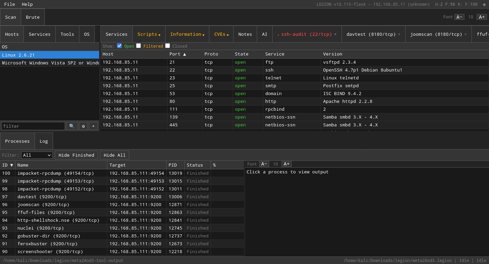

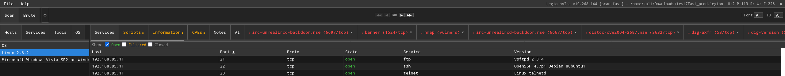

---

## Table of Contents

- [What is LegionnAIre?](#what-is-legionnaire)
- [Why I built this](#why-i-built-this)
- [Features](#features)
- [Integrated tools](#integrated-tools)
- [Requirements](#requirements)
- [Installation — Automated](#installation--automated-recommended)
- [Installation — Manual](#installation--manual-step-by-step)
- [Installation — WSL2](#installation--kali-wsl2-windows-users)
- [Installation — Docker](#installation--docker-alternative)
- [Upgrading](#upgrading)
- [Quick start](#quick-start)
- [Configuration](#configuration)
- [Test suite](#test-suite)
- [Architecture](#architecture)
- [Attribution](#attribution)
- [License](#license)

---

## What is LegionnAIre?

LegionnAIre is an open source, semi-automated network penetration testing framework for discovery, reconnaissance, and exploitation. It is a fork of [Legion](https://github.com/Hackman238/legion), which was itself a fork of [Sparta](https://github.com/SECFORCE/sparta) — a tool that has been in active pentest use since 2015.

The core workflow is the same but enhanced:

1. **Add targets** — IPs, CIDRs, hostnames, ranges, or a file of targets. LegionnAIre adds them to scope.
2. **Scan** — nmap runs staged port scans across your targets. Services are identified and versioned.
3. **Auto-Enumerate** — 179 scheduler rules across 80+ preconfigured tools fire automatically on service discovery. HTTP gets feroxbuster, nuclei, gobuster. SSH gets ssh-audit. SMB gets netexec and enum4linux-ng. And so on — zero manual configuration needed.
4. **Investigate** — browse results by host: open ports, service versions, CVEs, NSE script output, screenshots, and tool output all in one place. **Search all output** with Ctrl+Shift+F across every tool in the project.
5. **Analyze with AI** — connect to any LLM (Claude, Gemini, GPT-4, or local models). The AI synthesizes all findings, recommends additional tools to fill coverage gaps (you approve each command), and generates an actionable attack plan. Export as a standalone HTML report.
6. **Document** — notes per host with Ctrl+B terminal capture (ANSI color preserved), scan commands auto-logged, AI-generated attack plan reports.
7. **Exploit** — right-click any host or port for a context menu of targeted tools. Open an interactive terminal embedded in the browser — output is captured to the database alongside all other results. Run Hydra against authentication services from the Brute tab.

Everything — every tool's output, every screenshot, every CVE, every note, every AI analysis — lives in a **single SQLite database** per project. Save, reopen, and pick up exactly where you left off.

### What the original Legion did — and still does

These are the foundational capabilities inherited from Sparta/Legion and fully preserved in this Flask rewrite:

- **Staged nmap scanning** — customizable port ranges scanned in sequence; each stage's results feed the next. Timing, fragmentation, host discovery, and custom options all configurable per scan.
- **Semi-automated tool scheduling** — `legion.conf` maps service names to tools. When nmap identifies a service, the matching tools run automatically without user intervention.
- **Rich context menus** — right-click any host or port for a list of relevant tools. Dozens of host actions (dnsrecon, masscan, theharvester) and port actions (nikto, wpscan, sslscan, sqlmap, and more) built in and fully customizable.
- **Multi-host scope management** — add individual IPs, CIDR subnets, ranges, or hostnames. Mark hosts as checked. Delete hosts from scope. Filter by OS, state, or service.
- **CPE and CVE detection** — Vulners NSE runs against every discovered service; CVEs are stored per host with severity and ExploitDB cross-references.
- **Integrated screenshotting** — EyeWitness captures web service screenshots automatically on HTTP/HTTPS discovery.
- **Hydra brute forcing** — the Brute tab targets FTP, SSH, MySQL, PostgreSQL, VNC, Telnet, and more with configurable wordlists.
- **Nmap XML import** — import existing scan results without re-scanning. All parsed data (hosts, ports, services, scripts) loads into the project database.
- **IPv6 support** — full IPv6 scanning with automatic fallback when connectivity is unavailable.
- **Project save and restore** — SQLite-backed sessions save all results, notes, process history, screenshots, and tool output. Pick up exactly where you left off.
- **Extensible tool configuration** — `legion.conf` defines every host action, port action, and scheduled tool. Add your own scripts with `[IP]`, `[PORT]`, and `[OUTPUT]` placeholders. No code changes required. LegionnAIre adds: a GUI config manager with **multiple profiles**, **syntax validation**, and **Easy Edit mode** so you never have to hand-edit the raw conf file.

---

## Why I built this

I've always liked Legion. The classic layout with hosts on the left, tabbed detail panels on the right, and a live process list at the bottom.  I think it is an excellent UX for a pentest workflow. But the PyQt6 desktop app was hard to develop with: it required a full Qt environment, X11 forwarding when working remotely, and a brittle dependency stack that seemed to break with Kali updates.

Since the main branch was moving to Flask, I rewrote the classic interface as a Flask web app. The layout is very close to the original. The keyboard shortcuts, tab structure, and process model are the same. The underlying Python scanning engine (`controller.py`, `logic.py`, the SQLAlchemy ORM, the staged nmap pipeline) is unchanged — I just replaced every Qt widget with its HTML equivalent, polled with a 1.5-second snapshot API instead of Qt signals, and ran the whole thing in a browser.

While I was in there I added the things I'd always wanted: embedded interactive terminals whose output is captured to the project database, AI host analysis with human-in-the-loop tool enumeration (Anthropic Claude, Google Gemini, OpenAI, or local models via ollama), real-time keyword match highlighting across all tool output with navigation arrows, global search across every process output in the database, enhanced note-taking with ANSI color preservation, parallel nmap stages, 80+ preconfigured tools that auto-install, config migration so updates don't overwrite your customizations, a config GUI so you don't have to hand-edit `legion.conf`, and a 675-test Selenium suite for developers. The name **LegionnAIre** reflects the AI addition and its Legion roots.

---

## Features

### Core scanning
- **Parallel staged nmap** — stages 1–5 (port ranges) run simultaneously; stage 6 (NSE/vulners) runs after all stages finish against every discovered open port
- **80+ tools, 179 auto-trigger rules** — all tool binaries are auto-installed by `install.sh`. The scheduler fires the right tool for each discovered service with zero manual configuration. Includes feroxbuster, gobuster, nuclei (40 template categories), netexec (18 modules), enum4linux-ng, ssh-audit, testssl, and more.
- **Live output streaming** — output appears in real time as tools run; progress % for nmap via `--stats-every 5s`
- **Keyword match highlighting** — configure match keywords in Settings; every line of every tool's output is scanned in real time. Matches turn orange with ▲/▼ navigation arrows
- **Global output search** — Ctrl+Shift+F searches all stored process output across every tool for any keyword. Matching processes are highlighted with cyan hit counts; click a result to see the output with cyan highlights and ▲/▼ navigation
- **Single unified database** — all tool output, CVEs, NSE scripts, screenshots, notes, match highlights, process history, and AI analyses stored in one SQLite file per project
- **Arrow-key navigation** — Up/Down arrow keys move between rows in any table (hosts, services, processes, tools, OS, scripts)

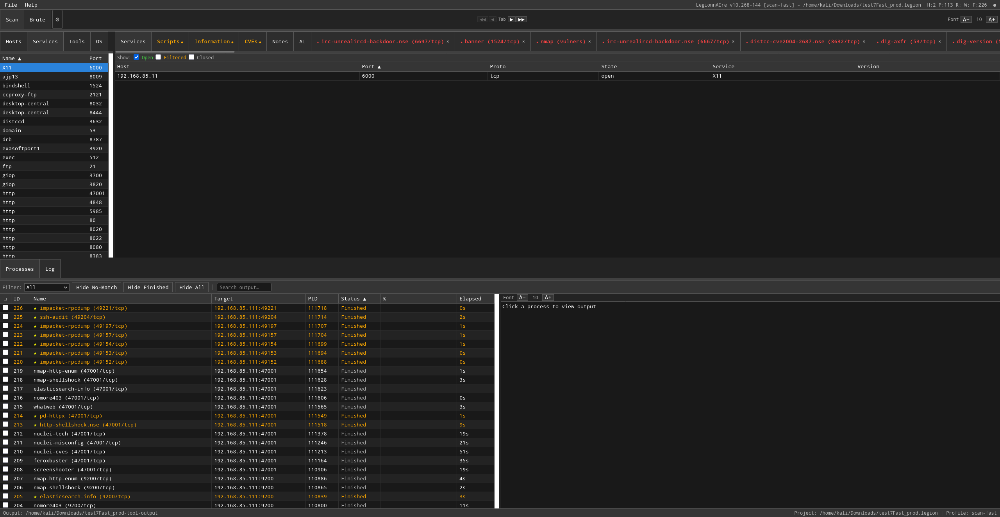

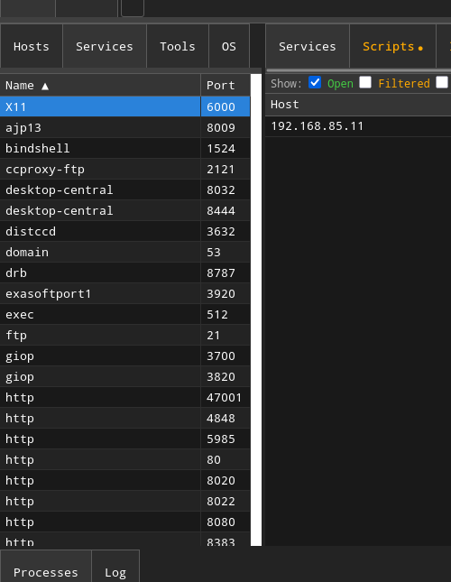

### Web interface
- Runs in any browser at `http://127.0.0.1:PORT` — works locally or over SSH port forwarding with no X11 needed
- Layout identical to the original Legion/LegionnAIre desktop app: host list left, tabbed panels right, process list bottom
- **All splitters draggable** with saved position; **font size controls** for upper and lower panels independently
- **Sticky process table header**, scrollable tab bar with ◀▶ scroll arrows, context menus that stay in viewport
- **⚙ gear button** next to Brute tab opens Config Manager (same as F2)
- **Status bar** shows H: (hosts) P: (ports) R: (running) W: (waiting) F: (finished) counters; bottom bar shows Output path, Project name, and active Profile
- **Multithreaded process control** — configurable concurrency limits for fast tools and slow tools (nmap) independently; queue management, process timeout, kill/restart from the UI
- Opens Firefox automatically on start with a dedicated isolated profile; `--input-file targets.txt` auto-scans targets from a file on startup

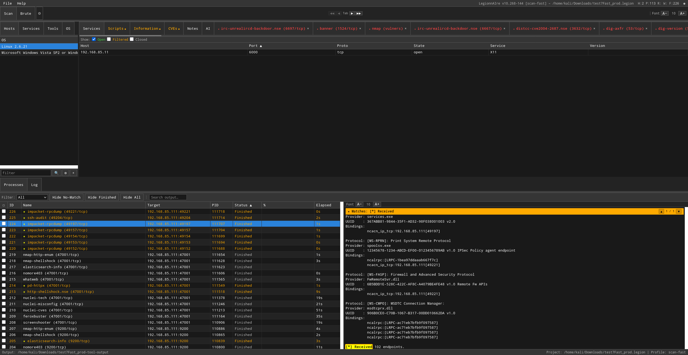

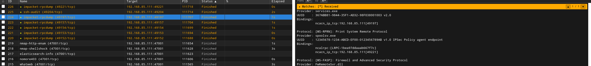

### AI host analysis (multi-provider)
- **Phase 1 — Synthesizer**: reads all tool output, NSE scripts, CVEs, and analyst notes for a host; extracts a structured findings table (severity-coded Critical/High/Medium/Low/Info)
- **Automated gap analysis** — after Phase 1, the AI recommends additional tools to fill coverage gaps. **You review and approve each command** before it runs (human-in-the-loop). Re-synthesis with enriched data produces more complete findings
- **Phase 2 — Attack Planner**: on-demand; takes Phase 1 findings (including gap-fill results) as input and produces a specific, actionable attack plan with exact commands
- **Attack plan reports** — export a self-contained HTML report with Phase 1 findings table (sortable by severity/port), Phase 2 attack plan, and enumeration commands run. Standalone file — no server needed to view
- **Persistent history DB** at `~/.local/share/legion/ai_history.db` — analyses survive project switches; Jaccard similarity matching shows historical hosts that look like the current target (≥95% match on port/service/version fingerprint)
- **↻ Refresh button** — re-reads AI config without leaving the tab; Vertex AI project ID auto-detected from gcloud CLI
- **Five provider options** — configure in `legion.conf` `[AISettings]` or use pre-built profiles:
  - **Anthropic** — direct API key auth (`api.anthropic.com`)
  - **Google Vertex AI** — Claude on GCP via Application Default Credentials (auto-detected)
  - **OpenAI** — GPT-4o, o3-mini, or any OpenAI model
  - **Google Gemini** — via OpenAI-compatible endpoint (free tier available)
  - **Local models** — ollama, vLLM, LM Studio, or any OpenAI-compatible server (free, runs on your GPU)

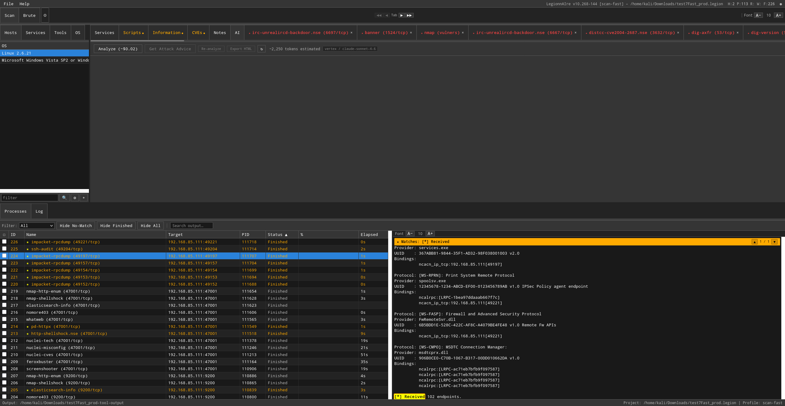

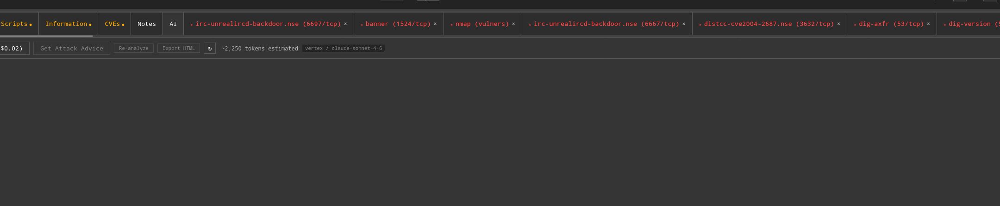

### Interactive terminals (xterm.js)

Right-click any host → **Open Terminal** to get a full PTY session embedded directly in the browser — no SSH client, no separate window. The terminal runs inside an xterm.js panel in the bottom output area alongside your tool processes.

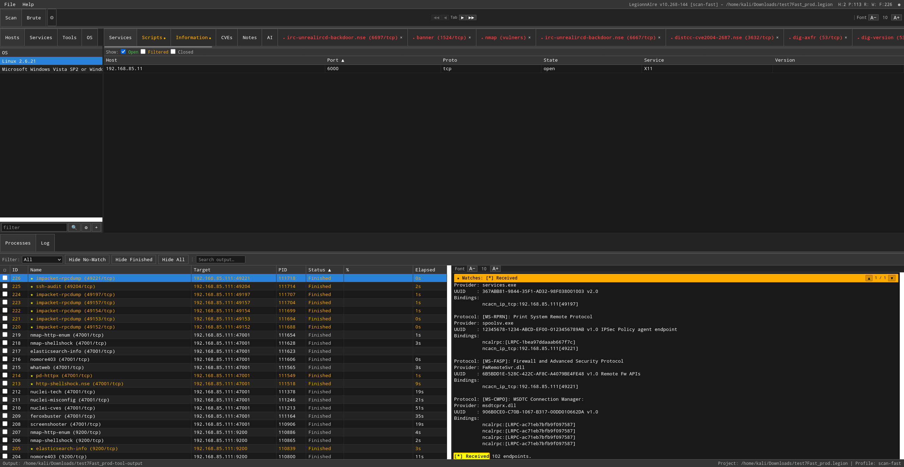

- **Full PTY** — readline, tab completion, color, cursor movement, scrollback all work exactly as in a real terminal
- **ANSI color preserved** — the Kali bash prompt, `ls` color coding, tool output highlights all render correctly
- **Ctrl+B to capture** — select any output in the terminal, press Ctrl+B, and it lands in the host's Notes tab with color intact
- **Output captured to database** — terminal history is written to the project SQLite DB on save/close, so it persists across sessions and is searchable via global search (Ctrl+Shift+F). Interactive scripts run inside the GUI produce output that is treated the same as any other tool — stored, searchable, included in AI analysis
- **Multiple sessions** — each Interactive process gets its own tab in the upper output panel; click between them without losing state
- **Font size controls** — A−/A+ buttons resize the terminal font independently of other output panels

### Config manager (F2) — profiles, syntax checking, Easy Edit

The original Legion required hand-editing a raw `.conf` file with no validation — a misplaced comma or missing `[IP]` placeholder silently broke tools. LegionnAIre replaces this with a full config management system.

Press **F2** (or click the **⚙ gear button**) to open the Config Manager.

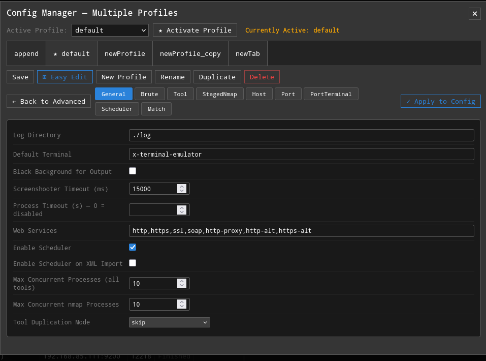

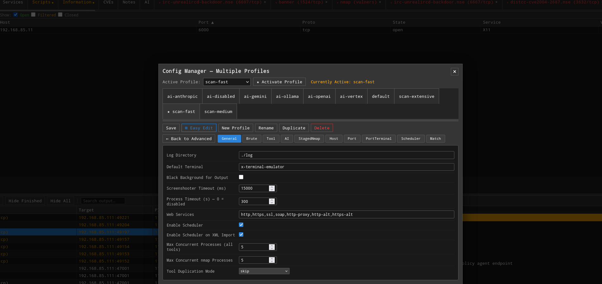

**Multiple profiles** — switch between scan profiles instantly from the profile dropdown: `scan-fast` (74 tools), `scan-medium` (120 tools), `scan-extensive` (179 tools), plus 6 AI provider profiles (`ai-anthropic`, `ai-vertex`, `ai-openai`, `ai-gemini`, `ai-ollama`, `ai-disabled`). Create, rename, duplicate, and delete custom profiles. The active profile name appears in both the title bar and the bottom status bar.

**Syntax validation** — every save validates the conf before writing: `[IP]` and `[PORT]` placeholders are checked in port action commands, section names are verified, and malformed entries are flagged with inline red-border errors that block the save until fixed.

**Easy Edit mode** — click **⊞ Easy Edit** to switch from the raw conf textarea to a structured form editor — no need to know the `legion.conf` syntax:

| Tab | What you can change |
|---|---|
| **General** | Max concurrent processes, process timeout, scheduler on/off, tool duplication mode |
| **Brute** | Hydra defaults — username, password, wordlist paths, per-service field visibility |
| **Tool** | Binary paths for nmap, hydra, and other tools |
| **AI** | Provider selection (dropdown), API key, model, endpoint URL, Vertex project/region |
| **StagedNmap** | Port ranges for each of the 6 scan stages (PORTS|spec or NSE|scripts) |
| **Host / Port / PortTerminal** | Searchable tables — add, edit, or remove host actions and port right-click menu entries with `[IP]`/`[PORT]` placeholder validation |
| **Scheduler** | Which tools fire automatically on service discovery, and for which service names |
| **Match** | Tag chip editor — add or remove keywords that get highlighted in tool output |

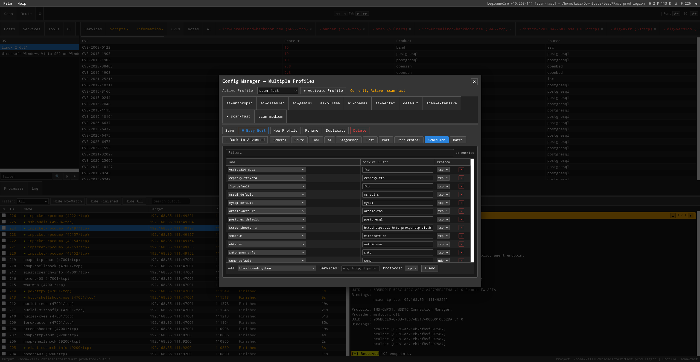

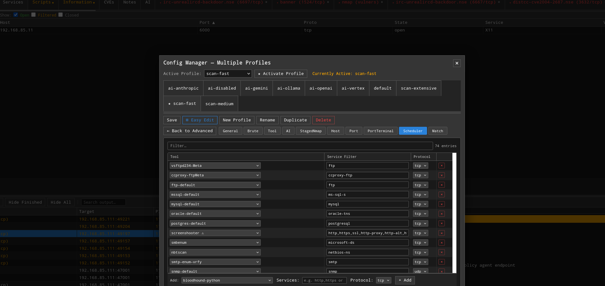

- **← Back to Advanced** applies your Easy Edit changes and returns to the raw textarea
- Every save is timestamped to `~/.local/share/legion/backup/` — nothing is lost
- **Config migration** — `--migrate-conf` CLI flag or yellow GUI banner merges new settings from updates without overwriting your customizations. Help comments are preserved.

### Enhanced notes
- **Ctrl+B** — copies the current terminal or DOM output selection into the host's Notes tab with ANSI color preserved
- Notes render with full ANSI-to-HTML conversion; the Log tab also renders color codes
- All nmap stage commands are written to Notes automatically so scans are reproducible
- Notes are per-host and persist in the unified project database — searchable via global search

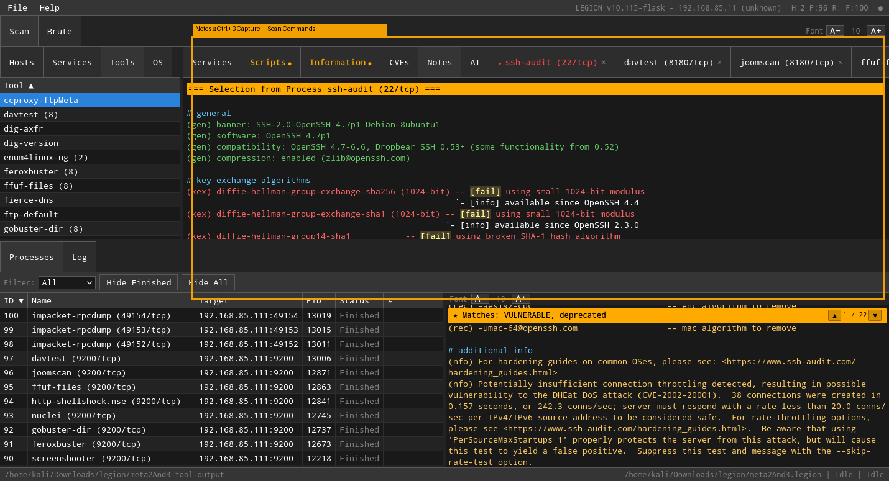

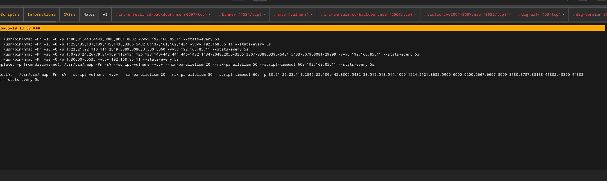

### CVEs and vulnerability data
- Vulners NSE runs as the final nmap stage against all discovered ports
- CVEs displayed per host with severity, description, and CVSS score
- NSE script output (smb-vuln-*, ssl-heartbleed, http-shellshock, etc.) stored per port in the Scripts tab

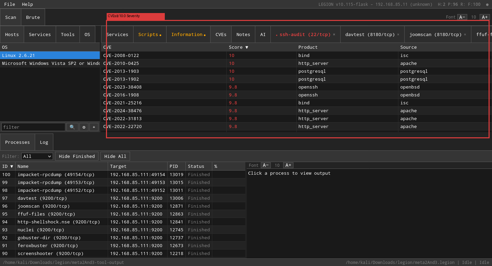

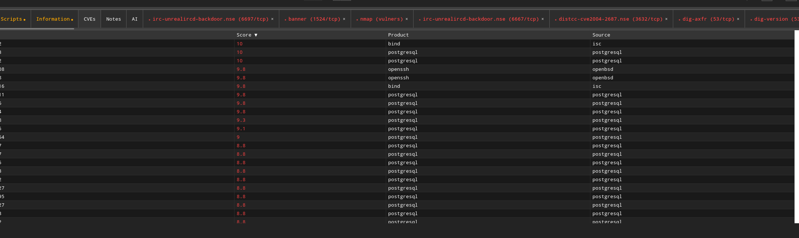

### Brute force
- Hydra wired to the Brute tab — username, password, wordlist fields pre-fill from `legion.conf` defaults
- Combo file support (`-C` flag) for credential pair lists
- Per-service show/hide for username/password fields (`no-username-services`, `no-password-services` in conf)

### Project management
- **Single SQLite database** per session (WAL mode) — every host, port, service, CVE, NSE script, tool output, screenshot, note, match highlight, process history, and AI analysis in one file. No shared state between instances
- Save / Save As / Open with full fidelity — screenshots, outputfile paths, keyword matches, interactive terminal history all persist correctly
- Heartbeat watchdog (5-minute timeout) — cleans up gracefully when the browser closes

---

## Integrated tools

LegionnAIre integrates **80+ unique tool binaries** — all preconfigured and auto-installed by `install.sh`. The scheduler has **179 auto-trigger rules** that fire the right tool for each discovered service with zero manual configuration. Tools are also available via right-click context menus (610 total conf entries including protocol variants and 204 individual nmap NSE scripts). A full interactive reference is available in [`legion_tools.html`](legion_tools.html).

### Port & service discovery
| Tool | Auto | Expected output |
|---|---|---|
| nmap (staged: 6 stages) | Yes | Ports, services, versions, OS, vulners CVEs |
| masscan | — | Full TCP port sweep (0-65535 at 1000 pps) |
| hping3 | — | SYN scan, ICMP timestamp, traceroute |
| ike-scan | Yes | IKE/IPSec VPN gateway detection and fingerprinting |
| rpcinfo | Yes | RPC service enumeration (portmapper) |
| showmount | Yes | NFS export listing |
| smtp-user-enum | Yes | SMTP user enumeration (EXPN/VRFY/RCPT) |
| swaks | Yes | SMTP open relay testing |
| nbtscan | Yes | NetBIOS name table enumeration |

### Web content discovery
| Tool | Auto | Expected output |
|---|---|---|
| feroxbuster | Yes | Directories and files from wordlist |
| feroxbuster-thorough | Yes | Dirs + files with extensions (.php/.bak/.conf), backup detection, GET+POST |
| gobuster dir / ext | Yes | Directory brute-force + extension scanning with backup discovery |
| gobuster vhost | Yes | Virtual hostname enumeration |
| gobuster dns | Yes | Subdomain enumeration via DNS |
| katana | Yes | Crawled URLs, JS endpoints, linked paths |
| katana-deep | Yes | Headless + jsluice + XHR + form fill + known files |
| katana-headless | Yes | Browser-rendered pages invisible to standard crawlers |
| ffuf | Yes | File fuzzing with filtered results |
| davtest | Yes | WebDAV upload/execute permissions |

### Web vulnerability scanning
| Tool | Auto | Expected output |
|---|---|---|
| nikto | Yes | Misconfigurations, default files, outdated software |
| nikto-ssl | Yes | Same but forces SSL for HTTPS ports |
| nikto-tuned | — | Focused on injection, RCE, auth bypass, file retrieval |
| nikto-mutate | Yes | Apache ~user enumeration, file name guessing |
| sqlmap-scan (safe) | Yes | SQL injection check (level=1, risk=1) |
| sqlmap-http (aggressive) | Yes | Deep SQL injection scan (level=3, risk=2) |
| nomore403 | Yes | 403 bypass techniques |
| jexboss | Yes | JBoss deserialization and deployment vulns |
| nuclei (40 categories) | Yes | CVEs, misconfigs, exposed panels, default logins, credential stuffing, DAST, and more |

### Web technology detection
| Tool | Auto | Expected output |
|---|---|---|
| httpx | Yes | Status, title, server, tech stack, favicon hash, TLS cert, CDN, JARM, ASN |
| whatweb | Yes | Server software, frameworks, CMS, language |
| wafw00f | Yes | WAF product name and vendor |
| wig | Yes | CMS name, version, platform |

### CMS scanning
| Tool | Auto | Expected output |
|---|---|---|
| wpscan | Yes | WP version, vulnerable plugins/themes, users, config backups, DB exports |
| joomscan | Yes | Joomla version, components, issues |

### SSL/TLS analysis
| Tool | Auto | Expected output |
|---|---|---|
| sslscan | Yes | Ciphers, certificate, protocol versions |
| sslyze | Yes | TLS config, cipher suites, known vulns |
| testssl | Yes | Comprehensive audit: BEAST, POODLE, Heartbleed, etc. |

### SMB / Windows enumeration
| Tool | Auto | Expected output |
|---|---|---|
| netexec --shares | Yes | Share listing with permissions |
| netexec --users | Yes | Domain user accounts |
| netexec --pass-pol | Yes | Password policy (lockout thresholds) |
| netexec --rid-brute | Yes | Users/groups via RID cycling |
| netexec --gen-relay-list | Yes | SMB signing disabled = relay targets |
| netexec -M zerologon | Yes | CVE-2020-1472 check |
| netexec -M smbghost | Yes | CVE-2020-0796 check |
| netexec -M printnightmare | Yes | Print spooler RCE check |
| netexec -M nopac | Yes | CVE-2021-42278/42287 check |
| netexec -M webdav/spooler | Yes | Coercion attack vector checks |
| netexec -M enum_av | Yes | Endpoint protection detection |
| netexec -M spider_plus | Yes | Recursive share file listing |
| smbmap | Yes | Share permissions |
| smbmap-recursive | Yes | File listing 3 levels deep |
| smbmap-signing | Yes | SMB signing status |
| enum4linux-ng | Yes | Users, groups, shares, policy, OS |
| rpcclient-full-enum | Yes | Users, groups, policy, shares, domain role |
| impacket-rpcdump | Yes | RPC endpoint enumeration |
| impacket-samrdump | — | SAM remote dump — users, aliases, groups |
| impacket-secretsdump | — | NTLM hashes, Kerberos keys, cleartext passwords (requires creds) |

### Active Directory
| Tool | Auto | Expected output |
|---|---|---|
| netexec ldap --users/--groups | Yes | Domain users and groups via LDAP |
| netexec ldap --asreproast | Yes | AS-REP roastable accounts |
| ldapsearch-anon/users | Yes | LDAP anonymous enumeration |
| certipy-find | Yes | Vulnerable AD CS templates (ESC1-ESC8) |
| adidnsdump-enum | Yes | AD-integrated DNS zones |
| windapsearch-users | Yes | Domain users via LDAP |
| ldeep-enum | Yes | Deep LDAP: users, groups, OUs, GPOs |
| gpp-sysvol-check | Yes | SYSVOL GPP XML with embedded passwords |
| impacket-getnpusers-nopass | Yes | AS-REP roastable accounts |
| impacket-lookupsid-null | Yes | SIDs via null session |
| impacket-getuserspns | — | Kerberoastable service accounts (requires creds) |
| bloodhound-python | Yes | Domain enumeration — users, groups, sessions, ACLs for BloodHound graph |
| ldapdomaindump | Yes | Domain users, groups, computers, policy via LDAP |

### SNMP enumeration
| Tool | Auto | Expected output |
|---|---|---|
| onesixtyone | Yes | Valid community strings |
| snmpwalk | Yes | Full MIB tree |
| snmpwalk-processes/users/software | Yes | Targeted OID walks (running processes, users, installed software) |
| snmpwalk-discovered | Yes | Walk using community strings found by onesixtyone |
| snmpcheck | Yes | System description, uptime, interfaces |

### DNS enumeration
| Tool | Auto | Expected output |
|---|---|---|
| dnsrecon | Yes | DNS records, zone transfer attempts |
| dig (version + axfr) | Yes | Server version, zone transfer contents |
| fierce | Yes | Subdomain brute-force |
| subfinder | Yes | Passive subdomain discovery |
| gobuster dns | Yes | DNS subdomain enumeration |
| theharvester | Yes | Emails, subdomains from OSINT |

### Credential testing
| Tool | Auto | Expected output |
|---|---|---|
| hydra (ssh/ftp/telnet/mysql/mssql/postgres/vnc/oracle) | Yes | Default credential check per service |
| netexec ftp/rdp/mssql | Yes | Anonymous/null access checks |

### OSINT & exploit search
| Tool | Auto | Expected output |
|---|---|---|
| searchsploit | — | ExploitDB matches for service versions |
| searchsploit-nmap | Yes | ExploitDB auto-matched against all nmap XML results |
| gau / waybackurls | Yes | Historical URLs from web archives |
| leaksearch | Yes | Credential leaks for the domain |

### Interactive terminals (right-click)
ssh, ftp, mysql, psql, mssql, telnet, netcat, redis-cli, rdesktop, vncviewer, evil-winrm, rpcclient, rlogin, rsh, impacket-smbclient, impacket-psexec, impacket-mssqlclient, msfconsole, xephyr — all open as embedded xterm.js PTY sessions in the browser. Output is captured to the project database.

---

## Requirements

**Recommended platform:** Kali Linux — either a VM (VMware/VirtualBox/Hyper-V) or Kali in WSL2. The installer handles everything on Kali. Ubuntu 22.04+ also works but requires more manual tool installation.

| Requirement | Minimum | Notes |
|---|---|---|
| **OS** | Kali Linux 2024.1+ | VM or WSL2; Ubuntu 22.04+ also works but Kali has most tools pre-installed |
| **Python** | 3.10+ | 3.11–3.13 tested |
| **Firefox ESR** | any recent | Opened automatically by `--web`; geckodriver needed for Selenium tests |
| **sudo / root** | required | nmap, masscan, and several schedulers need raw socket access |
| **Go** | 1.20+ | Needed to install pd-httpx, katana, gau, waybackurls, nomore403, urlfinder |
| **Disk** | ~3 GB | Tools + Python packages + project databases + Go tool chain |

---

## Installation — Automated (recommended)

The automated installer handles everything in one step: Python packages, system tools, geckodriver, Firefox profile, and optional AI tab setup.

> **Important:** The Flask web UI lives on **two branches**:
> - **`flask-clean-prod`** — stable release branch. Use this for normal installs.
> - **`flask-clean`** — development branch. Use this if you want the latest changes or plan to contribute.
>
> The default `master` branch is the original upstream Qt5 desktop app.
> The `--branch` flag below is **required** — without it you will clone
> the wrong codebase and `python3 legion.py --web` will not exist.

```bash
# Production install (recommended)
sudo git clone --branch flask-clean-prod https://github.com/ThereAreSomeWhoCallMeTimAtViasat/legionnaire.git
cd legion

# Confirm you are on the right branch before continuing
sudo git branch        # should show: * flask-clean-prod

sudo bash install.sh
```

To install the **development branch** instead:
```bash
sudo git clone --branch flask-clean https://github.com/ThereAreSomeWhoCallMeTimAtViasat/legionnaire.git
cd legion
sudo bash install.sh
```

**Options:**

| Flag | Effect |
|---|---|
| `--no-ai` | Skip the AI provider setup prompt at the end |

---

## Installation — Manual (step by step)

Use this if you need to understand what each step does, skip certain parts, or troubleshoot a failed automated install.

### Step 1 — Clone the repository onto the correct branch

The repository has multiple branches:
- **`flask-clean-prod`** — stable release branch (recommended for most users)
- **`flask-clean`** — development branch (latest changes, may be less stable)
- `master` — original upstream Qt5 desktop app (does not have `--web` mode)

```bash
# Production (recommended)
sudo git clone --branch flask-clean-prod \
    https://github.com/ThereAreSomeWhoCallMeTimAtViasat/legionnaire.git
cd legion

# Or development branch:
# sudo git clone --branch flask-clean \
#     https://github.com/ThereAreSomeWhoCallMeTimAtViasat/legionnaire.git

# Verify you are on the right branch before doing anything else
sudo git branch
# Output must show:   * flask-clean-prod   (or * flask-clean for dev)
# If it shows master or anything else, run:  sudo git checkout flask-clean-prod

sudo git log --oneline -3
# Should show recent commits starting with "v10.xxx" version tags
```

### Step 2 — Install Python packages

`install.sh` creates a virtual environment at `/opt/legion-venv` and installs all packages there — no `--break-system-packages` needed. `legion.py` auto-detects and re-execs into the venv on startup.

If you need to install manually (without `install.sh`):

```bash
sudo python3 -m venv /opt/legion-venv
sudo /opt/legion-venv/bin/pip install -r requirements.txt
```

**Verify:**
```bash
sudo /opt/legion-venv/bin/python3 -c "import flask, sqlalchemy, anthropic, openai; print('OK')"
# Expected: OK
```

If this fails, check:
- Python version: `python3 --version` must be 3.10+
- The venv exists: `ls /opt/legion-venv/bin/python3`

### Step 3 — Install system security tools

`install.sh` handles everything in one pass. If you are doing a manual install,
run it with `sudo` — it installs apt packages, Go binaries, GitHub tools, and
Python `/opt` tools, all requiring root:

```bash
sudo bash install.sh --no-ai
```

What it installs beyond what Kali pre-includes:

| Tool | Method | Purpose |
|---|---|---|
| `golang-go` | apt | Required for all Go-based tools |
| `pd-httpx` | Go | HTTP technology detection |
| `katana` | Go | Web crawler |
| `gau` | Go | Passive URL collection |
| `waybackurls` | Go | Wayback Machine URL fetch |
| `nomore403` | Go | 403 bypass checker |
| `urlfinder` | Go | URL extraction |
| `kerbrute` | GitHub binary | Kerberos user enum |
| `rdp-sec-check` | apt / GitHub Perl | RDP security audit |
| `jexboss` | `sudo git clone` → `/opt/jexboss` | JBoss vulnerability scanner |
| `LeakSearch` | `sudo git clone` → `/opt/LeakSearch` | Credential leak search |
| `nuclei templates` | `nuclei -update-templates` | Required before nuclei can scan |

All individual install commands inside the script run with `sudo` — apt-get,
sudo git clone, sudo pip install, go install, curl, cp, chmod.  Expected runtime:
5–15 minutes depending on network speed.

**Verify individual tools after install:**
```bash
for t in pd-httpx katana gau waybackurls nomore403 urlfinder kerbrute nuclei ssh-audit; do
    command -v $t && echo "✓ $t" || echo "✗ $t — missing"
done
```

### Step 4 — geckodriver (required for Selenium tests and screenshooter)

**On Kali:** geckodriver is already at `/usr/bin/geckodriver` — nothing to do.

**On Ubuntu:**
```bash
# Find the latest release at https://github.com/mozilla/geckodriver/releases
GECKODRIVER_VERSION="v0.35.0"
sudo curl -fsSL \
    "https://github.com/mozilla/geckodriver/releases/download/${GECKODRIVER_VERSION}/geckodriver-${GECKODRIVER_VERSION}-linux64.tar.gz" \
    | sudo tar xz -C /usr/local/bin
sudo chmod +x /usr/local/bin/geckodriver
geckodriver --version   # verify
```

### Step 5 — (Optional) AI tab — choose a provider

The AI tab supports multiple backends. Pick **one** of the options below and
configure it in `legion.conf` under `[AISettings]`. You can edit this section
via Config Manager (F2 → Easy Edit or Advanced mode) or directly:

```bash
sudoedit /root/.local/share/legion/legion.conf
```

Scroll to the `[AISettings]` section at the bottom of the file.

#### Option A — Anthropic direct API (simplest)

Get an API key from [console.anthropic.com](https://console.anthropic.com/).

```ini
[AISettings]
ai_provider=anthropic
ai_api_key=sk-ant-api03-YOUR-KEY-HERE
ai_model=claude-sonnet-4-6
ai_api_url=
ai_vertex_project_id=
ai_vertex_region=global
```

#### Option B — Google Gemini

Get an API key from [Google AI Studio](https://aistudio.google.com/apikey).
This uses Google's OpenAI-compatible endpoint — no GCP project required.

```ini
[AISettings]
ai_provider=openai
ai_api_key=YOUR-GEMINI-API-KEY
ai_model=gemini-2.5-flash
ai_api_url=https://generativelanguage.googleapis.com/v1beta/openai/
ai_vertex_project_id=
ai_vertex_region=global
```

Available Gemini models: `gemini-2.5-flash` (fast/cheap), `gemini-2.5-pro` (most capable), `gemini-2.0-flash`.

#### Option C — OpenAI

```ini
[AISettings]
ai_provider=openai
ai_api_key=sk-YOUR-OPENAI-KEY
ai_model=gpt-4o
ai_api_url=
ai_vertex_project_id=
ai_vertex_region=global
```

#### Option D — Local models (ollama, vLLM, LM Studio)

Any server that speaks the OpenAI chat completions API works. No API key needed for local servers.

```ini
[AISettings]
ai_provider=openai
ai_api_key=not-needed
ai_model=llama3
ai_api_url=http://localhost:11434/v1/
ai_vertex_project_id=
ai_vertex_region=global
```

For **ollama**: `ai_api_url=http://localhost:11434/v1/`
For **vLLM**: `ai_api_url=http://localhost:8000/v1/`
For **LM Studio**: `ai_api_url=http://localhost:1234/v1/`

#### Option E — Google Vertex AI (GCP)

For users who access Claude through a Google Cloud project. Uses Application
Default Credentials — no API key stored.

**Prerequisites:** a GCP project with the Vertex AI API enabled.

```bash
gcloud auth application-default login
```

```ini
[AISettings]
ai_provider=vertex
ai_api_key=
ai_model=claude-sonnet-4-6
ai_api_url=
ai_vertex_project_id=your-gcp-project-id
ai_vertex_region=global
```

#### Legacy Vertex AI users

If you previously configured Vertex AI via `~/.claude/settings.json` (the old
method), it still works automatically — LegionnAIre falls back to that file when
`ai_provider` is empty or `none`. No migration required, but moving to
`legion.conf` is recommended.

#### Settings reference

| Setting | Required for | Description |
|---|---|---|
| `ai_provider` | all | `anthropic`, `openai`, or `vertex` |
| `ai_api_key` | anthropic, openai | Your API key (not needed for vertex or local models) |
| `ai_model` | all | Model name (e.g. `claude-sonnet-4-6`, `gpt-4o`, `gemini-2.5-flash`) |
| `ai_api_url` | openai (non-default) | Base URL for the API — leave blank for OpenAI's default; set for Gemini, ollama, etc. |
| `ai_vertex_project_id` | vertex | GCP project ID |
| `ai_vertex_region` | vertex | GCP region (default: `global`) |

### Step 6 — Verify the complete install

Runs parametrized tests that check every Python import, verify LegionnAIre starts in web mode, and check that every tool binary is in PATH:

```bash
sudo python3 -m pytest tests/test_requirements.py --noconftest -v
```

Expected output:
```
tests/test_requirements.py::test_shared_package_imports[flask-flask] PASSED
tests/test_requirements.py::test_flask_web_mode_starts_and_responds PASSED
tests/test_requirements.py::test_qt6_qapplication_offscreen PASSED
tests/test_requirements.py::test_kali_apt_tool_present[nmap] PASSED
...
XX passed in ~45s   (count varies by Kali version and installed tools)
```

If some tool binary tests fail, run `sudo bash install.sh --no-ai` — step 8 of
the installer automatically detects failed tests, installs the missing tools,
and retries up to three times.

---

## Installation — Kali WSL2 (Windows users)

The recommended way to run LegionnAIre on Windows is Kali Linux in WSL2 — no Docker needed, no VM overhead, full scanning capability.

```bash
# 1. Install Kali WSL2 from Microsoft Store, or:
#    wsl --install -d kali-linux

# 2. Inside Kali:
sudo git clone --branch flask-clean-prod \
    https://github.com/ThereAreSomeWhoCallMeTimAtViasat/legionnaire.git
cd legion
sudo bash install.sh

# 3. Start LegionnAIre
sudo python3 legion.py --web --no-browser
# Open http://127.0.0.1:5000 in your Windows browser
```

Use `--no-browser` because WSL2 without WSLg has no GUI. If you have WSLg (Windows 11 22H2+), Firefox will open automatically without the flag.

---

## Installation — Docker (alternative)

A `Dockerfile` and `docker-compose.yml` are included for users who prefer containers. Docker is most useful on non-Kali systems (Ubuntu desktop, macOS, CI) where you don't want to install security tools on the host.

> **Note:** For Kali VM or WSL2 users, the native install above is simpler and avoids Docker networking limitations.

```bash
sudo git clone --branch flask-clean-prod \
    https://github.com/ThereAreSomeWhoCallMeTimAtViasat/legionnaire.git
cd legion
sudo docker compose build && sudo docker compose up -d
# Open http://127.0.0.1:5000
```

See the `Dockerfile` and `docker-compose.yml` for full options (custom port via `LEGION_PORT`, project directory mount via `LEGION_PROJECTS_DIR`, `--cap-add NET_ADMIN` for raw socket scanning).

---

## Upgrading

### From source (production — `flask-clean-prod`)

```bash
git pull origin flask-clean-prod
sudo bash install.sh                          # picks up new dependencies + tools
sudo python3 legion.py --web                  # auto-detects outdated config, prompts to migrate
```

Or non-interactively:

```bash
sudo python3 legion.py --migrate-conf         # merge new settings without prompting
sudo python3 legion.py --web
```

### From source (development — `flask-clean`)

```bash
git pull origin flask-clean
sudo pip install -r requirements.txt          # pick up new Python packages
sudo python3 legion.py --web                  # same auto-detect + prompt
```

### What migration does

- **Backs up** your current config to `~/.local/share/legion/backup/`
- **Adds** new config sections (e.g. `[AISettings]`) without touching existing ones
- **Adds** new tool entries to SchedulerSettings / PortActions without removing yours
- **Adds** new match keywords without removing yours
- **Updates** shipped profiles (scan-fast, scan-medium, scan-extensive) with new entries
- **Never overwrites** your customized values

You can also migrate from the web UI — a yellow banner appears at the top of the page when an update is available.

### Recovery

```bash
sudo python3 legion.py --reset-conf           # full reset from masterLegion.conf (backs up first)
```

---

## Quick start

```bash
# Start the server (opens Firefox automatically)
sudo python3 legion.py --web

# Custom port
sudo python3 legion.py --web --port 8080

# Without auto-browser
sudo python3 legion.py --web --no-browser

# Auto-scan targets from a file
sudo python3 legion.py --web --input-file targets.txt
```

Navigate to `http://127.0.0.1:5000` (or your chosen port).

1. **Add a host** — type an IP, CIDR, or hostname in the Add Hosts dialog; click Staged Scan
2. **Watch the scan** — five nmap stages run in parallel; the process list shows live progress %; vulners runs last
3. **Review results** — Services, Ports, Scripts, CVEs, and Notes tabs populate as data arrives
4. **Search** — press Ctrl+Shift+F to search all tool output for any keyword
5. **Configure** — press F2 (or click ⚙) to open the Config Manager; use Easy Edit to add tools or adjust settings without touching the raw conf file
6. **Analyze with AI** — click the AI tab on any host; click Analyze when all scans finish

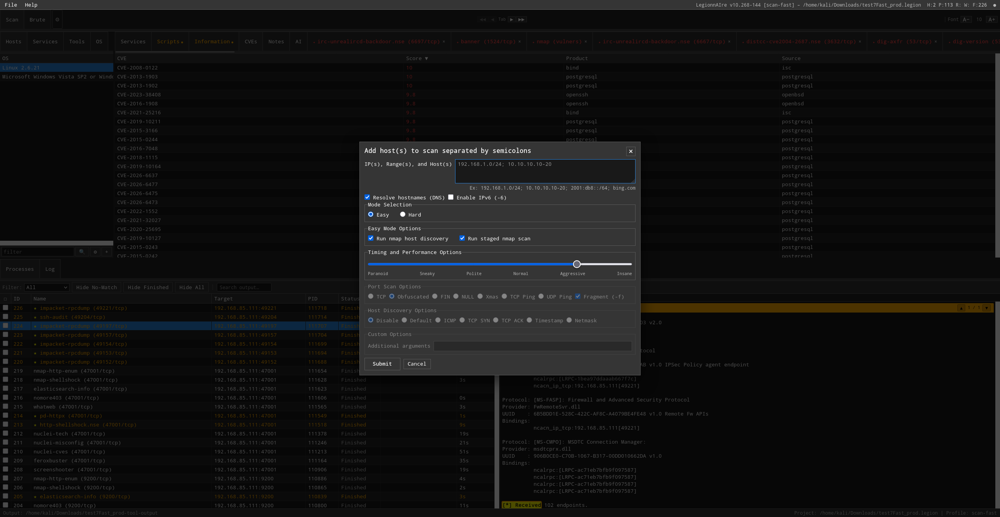

---

## Configuration

The main config file is at `~/.local/share/legion/legion.conf` (created on first run from the repo default).

Press **F2** (or click **⚙**) → **⊞ Easy Edit** to configure everything through a structured GUI — no need to know the conf syntax. The Scheduler tab shown below controls which tools fire automatically when a service is discovered.


To edit the raw conf directly:
```bash
sudoedit /root/.local/share/legion/legion.conf
```

Key sections:

| Section | Purpose |
|---|---|
| `[GeneralSettings]` | Max concurrent processes, scheduler toggle, process timeout |
| `[StagedNmapSettings]` | Port ranges per stage (stages 1–5 PORTS, stage 6 NSE) |
| `[SchedulerSettings]` | Tools that auto-run on service discovery |
| `[PortActions]` | Right-click menu tools for ports |
| `[HostActions]` | Right-click menu tools for hosts |
| `[BruteSettings]` | Hydra defaults, wordlist paths |
| `[ToolSettings]` | Binary paths (nmap, hydra, etc.) |
| `[MatchSettings]` | Keywords highlighted in tool output |
| `[AISettings]` | AI provider, API key, model, endpoint URL |

`config_version` in `[GeneralSettings]` tracks the conf schema version (matches the Legion point version, e.g. `config_version=268`). The migration system uses this to detect when new settings are available.

---

## Test suite

```bash
# Minimum before every commit
sudo python3 tests/test_behavioral.py

# Full offline suite (unit + Selenium)
sudo bash run_tests.sh

# With live target (Metasploitable at given IP)
sudo bash run_tests.sh 192.168.85.11

# Specific suites
sudo bash run_tests.sh --unit
sudo bash run_tests.sh --selenium
sudo bash run_tests.sh --stories
```

Tests require geckodriver:
```bash
sudo apt install firefox-esr
wget https://github.com/mozilla/geckodriver/releases/latest/download/geckodriver-v0.35.0-linux64.tar.gz
tar xf geckodriver-v0.35.0-linux64.tar.gz && sudo mv geckodriver /usr/bin/
```

---

## Architecture

```
Browser  ──HTTP──►  Flask (legion.py --web)
                        │
                    app/web/routes.py        ← all API endpoints
                        │
                    controller/web_controller.py   ← Qt-free engine
                        │
              ┌─────────┴──────────┐
              │                    │
    controller/controller.py   db/SqliteDbAdapter.py
    (original Qt6 — unmodified)    (SQLAlchemy ORM, WAL mode)
```

The Flask layer wraps the original Qt6 controller with zero changes to the scanning logic:

| Qt6 | Flask equivalent |
|---|---|
| `QProcess.start(cmd)` | `subprocess.Popen(cmd, shell=True)` |
| `QTimer.singleShot(ms, fn)` | `threading.Timer(ms/1000, fn).start()` |
| `QTableView` | HTML table, polled every 1.5s |
| Qt signals | JS polling `/api/snapshot` |
| `self.view.updateInterface()` | no-op (browser polls) |

---

## Attribution

- Fork of [Hackman238/legion](https://github.com/Hackman238/legion) by Shane Scott
- Original Sparta Python 2.7 codebase by [SECFORCE](https://github.com/SECFORCE/sparta)
- Flask web UI, parallel staged nmap, AI integration, and all features described above by Tim McLean (ifly53e, ThereAreSomeWhoCallMeTimAtViasat)
- nmap XML parsing engine originally by yunshu, modified by ketchup and SECFORCE
- Relies on nmap, hydra, SQLAlchemy, Flask, xterm.js, and many other open source tools

---

## License

GNU General Public License v3.0 — see [LICENSE](LICENSE)
